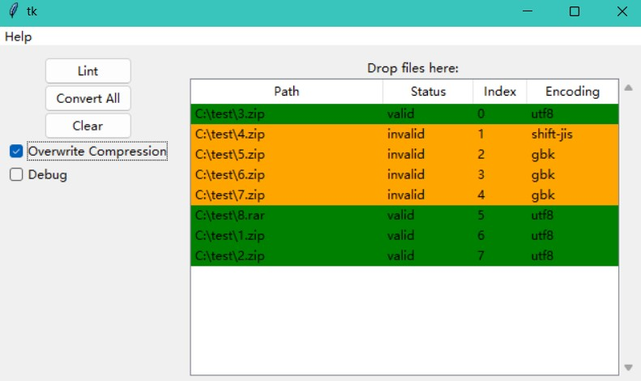

# zip-charset-rectifier
Convert Non-UTF8 zip and rar files to UTF8 zip files.

# CLI
```bash
usage: zipconv [-h] [-d DECODING] [-o OUTPUT] [-O] [--debug] [--force] [-L] [-e ENCODING] [--tmpdir TMPDIR] file_path

positional arguments:
  file_path

options:
  -h, --help            show this help message and exit
  -d DECODING, --decoding DECODING
                        shift-jis (default), gbk, ...
  -o OUTPUT, --output OUTPUT
  -O, --overwrite
  --debug
  --force               do not backup for overwrite, do not check if output exists
  -L, --lint-only       check if is encoded
  -e ENCODING, --encoding ENCODING
                        for lint: utf-8, gbk, ...
  --tmpdir TMPDIR
```

```bash
pdm run src/zip_charset_rectifier/cli.py
```

# GUI


1. Drag and Drop Support
2. Color Lint

```bash
pdm run src/zip_charset_rectifier/gui.py
```

# Background
> ZIP 文件标准在历史上并未指定元数据编码格式，但是强烈建议使用 CP437（原始 IBM PC 编码格式）来实现互操作性。 最近的版本允许（仅）使用 UTF-8。 在这个模块中，如果成员名称包含任何非 ASCII 字符则将自动使用 UTF-8 来写入它们。 不可能用 ASCII 或 UTF-8 以外的任何其他编码格式来写入成员名称。
> -- Python Docs

虽然ZIP文件有惯例的元数据编码格式(CP437和UTF-8), 但由于历史原因, 许许多多的ZIP文件使用诸如GBK, SHIFT-JIS之类的非标准元数据编码格式, 这导致文件名的乱码。
防止乱码最好的方式是避免使用非英文字符，但显然这是不太可能的。

# Developing
```bash
pdm run pyinstaller -p src/zip_charset_rectifier -F --clean --additional-hooks-dir=. src/zip_charset_rectifier/gui.py
```

# License
AGPL-3.0-only